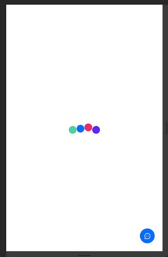
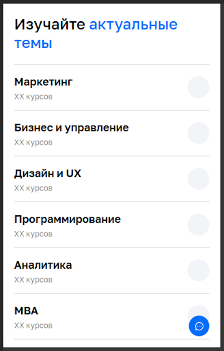

# Нетология - тестовое задание для тренеров 

Приложение, отправляющее запрос на сервер и отображающее список направлений обучения

## Формулировка задания

Вам нужно написать небольшое приложение, которое мы назовём Loader.

### Основная функциональность

Приложение отправляет запросы по протоколу HTTP на следующий URL: https://gitcdn.link/repo/netology-code/rn-task/master/netology.json
(либо https://raw.githubusercontent.com/netology-code/rn-task/master/netology.json)

На время загрузки отображается лоадер (лоадер можете выбрать любой, не обязательно этот):

После загрузки необходимо обработать JSON так, чтобы на странице отображалось:

## Описание решения

Основной код приложения находится в папке *src/main/java/com/mikevarl/netology*

Приложение демонстрирует подход к архитектуре **MVVM**: 
- есть **модели** — типы данных, которые нужно отобразить (`Direction`, `Badge`) и источник этих данных `DirectionsSource`, а также `JsonService`, чтобы получить данные с сервера
- `MainActivity` и адаптеры (`DirectionsAdapter`, `DirectionsHeaderAdapter`) отвечают за **отображение** - то, что пользователь видит на экране. Список отображается с помощью `RecyclerView` - класс, который в данный момент рекомендует Google. Как конкретно рисуется экран и элементы списка, описано в *.xml* файлах в папке *src/main/res/layout*
- `DirectionListViewModel` связывает данные и отображение. Этот класс запрашивает список направлений у `DirectionsSource` на старте приложения. А `MainActivity` подписывается на изменение данных во `ViewModel` и передаёт их в адаптеры для отрисовки.

Ниже будет приведено более подробное описание каждого слоя приложения. Подробное описание работы упомянутых классов можно увидеть в комментариях к коду.

### Model

#### Data Classes

Типы данных **бизнес-логики** приложения расположены в пакете *com.mikevarl.netology.data.model*. Эти типы и их параметры взяты из приходящего с сервера файла, для удобства. Большинство полей классов `Group` и `Course` не используются.

Такие типы данных удобно описывать с помощью `data class` языка Kotlin

#### Data Source

Интерфейс `DirectionsSource` описывает, какие данные нам нужны для отображения — список направлений. В том же файле приведены две реализации этого интерфейса: тестовая (без запроса к серверу), и реальная.

#### Network

Класс `JsonService` содержит объекты для генерации методов запросов к серверу и получения результатов в форме наших моделей. 

Я использую библиотеку **Retrofit** для запросов к серверу и **Moshi** для парсинга ответов.

### View

#### Activity

Приложение содержит единственный экран — `MainActivity`. 

Активити показывает лоадер, пока список не получен с сервера, а потом переключает лоадер на `RecyclerView` со списком направлений.

#### RecyclerView и адаптеры

`RecyclerView` — стандартный Android-класс для отображения списков. Он имеет много настроек, однако в данном примере нам не требуется сложная конфигурация.

В этом приложении отображается всего два типа элементов: заголовок и направление обучения. Для каждого из них написан свой адаптер — класс связывающий данные и их отображение в списке.

`DirectionsHeaderAdapter` не получает никаких данных и не содержит логики, он нужен только для корректной работы `RecyclerView`.

`DirectionsAdapter` описывает, как отобразить данные из `Direction` в нашем списке. Он соединяет *layout* и поля направления, а также позволяет нарисовать `Badge` цветом, полученным с сервера.

### ViewModel

`DirectionListViewModel` выступает в роли прослойки между данными и их отображением. 

При инициализации происходит запрос к источнику данных `DirectionsSource`, а активити получает оповещения об изменении данных с помощью `LiveData`

Подробнее об этих паттернах можно почитать в [документации для разработчиков Android](https://developer.android.com/topic/libraries/architecture/viewmodel)

## New Title